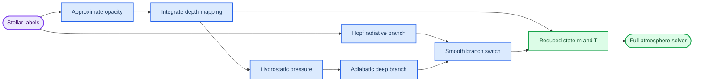

# Hopf 温度关系与 polytropic/adiabatic 大气近似：逐步推导

_面向 Payne-Zero 解析初始化器研究的恒星大气物理笔记，2026-08-16_

---

## 📋 目标与结论预览

这份笔记推导两类互补的大气近似：

1. **Hopf/radiative 分支**描述光学薄表面到辐射主导区域：

   $$
   T_{\rm rad}^4(\tau_{\rm R})
   =
   \frac{3}{4}T_{\rm eff}^4
   \left[\tau_{\rm R}+q(\tau_{\rm R})\right].
   $$
2. **Polytropic/adiabatic 分支**描述高效对流使熵近似不变的深层：

   $$
   T_{\rm ad}(P)
   =
   T_{\rm tr}
   \left(\frac{P}{P_{\rm tr}}\right)^{\nabla_{\rm ad}}.
   $$

它们并不是两套互相竞争的全局大气解。Hopf 分支处理辐射边界和非局域逃逸；adiabatic 分支处理深层对流。解析初始化器需要用 opacity-aware 的 $m(\tau)$ 将二者连接起来，再把近似状态交给完整物理 solver。

> 📌 **核心区别：** Eddington-grey 的 $q=2/3$ 是一种角分布与表面边界近似；Hopf function $q(\tau)$ 是把完整灰色或非灰色辐射转移相对于深层扩散解的偏离编码成一个深度函数。

## 📚 几何、符号与基本假设

### 平面平行几何

令 $z$ 沿恒星半径向外增加，重力加速度的大小为 $g>0$，方向向内。对于薄大气，

$$
\Delta r \ll R_\star,
$$

因此可以近似：

- 每层是平面；
- $g$ 在大气厚度内近似常数；
- 物理量只随 $z$ 变化。

后面也会使用向内增加的几何深度

$$
x\equiv -z.
$$

### 柱质量

某层之上的柱质量定义为

$$
m(z)
\equiv
\int_z^\infty \rho(z')\,dz',
$$

单位为 ${\rm g\,cm^{-2}}$。微分为

$$
dm=-\rho\,dz=\rho\,dx.
$$

因此 $m$ 从表面向内严格增加。

### 光学深度

频率 $\nu$ 处的光学深度定义为

$$
\tau_\nu(z)
\equiv
\int_z^\infty \kappa_\nu(z')\rho(z')\,dz',
$$

其中 $\kappa_\nu$ 是单位质量消光系数。利用柱质量，

$$
d\tau_\nu
=
\kappa_\nu\,dm
=
-\kappa_\nu\rho\,dz.
$$

所以

$$
\tau_\nu(m)
=
\int_0^m \kappa_\nu(m')\,dm'.
$$

这条式子已经揭示了解析初始化器的核心困难：$m\leftrightarrow\tau$ 的映射取决于不透明度，而不透明度又取决于 $T$、$P$、电子密度和化学组成。

### 辐射方向

令

$$
\mu_{\rm ray}\equiv\cos\theta
$$

为光线方向与向外法线的夹角余弦：

- $\mu_{\rm ray}>0$：辐射向外传播；
- $\mu_{\rm ray}<0$：辐射向内传播；
- $\tau$ 向内增加。

为避免混淆，本文用 $\mu_{\rm gas}$ 表示气体的平均分子量。

### 灰色 Hopf 推导的假设

最简单推导采用：

- 静态、平面平行大气；
- LTE；
- 真吸收主导，源函数 $S_\nu=B_\nu(T)$；
- 灰色不透明度，即深度坐标对所有频率相同；
- 无外部照射；
- 辐射平衡；
- 半无限大气。

散射、频率依赖 opacity、对流和球对称效应会在后面的推广中讨论。

## 📚 从辐射转移方程到矩方程

### 从发射与消光写出转移方程

沿一条路径 $s$，单色辐射转移方程为

$$
\frac{dI_\nu}{ds}
=
\eta_\nu-\chi_\nu I_\nu,
$$

其中：

- $I_\nu$ 是比强度；
- $\eta_\nu$ 是体发射系数；
- $\chi_\nu$ 是单位长度消光系数。

定义源函数

$$
S_\nu\equiv\frac{\eta_\nu}{\chi_\nu},
$$

得到

$$
\frac{dI_\nu}{ds}
=
-\chi_\nu(I_\nu-S_\nu).
$$

平面平行几何中

$$
dz=\mu_{\rm ray}\,ds.
$$

又因为

$$
d\tau_\nu=-\chi_\nu\,dz,
$$

所以

$$
\boxed{
\mu_{\rm ray}
\frac{\partial I_\nu}{\partial\tau_\nu}
=
I_\nu-S_\nu
}
\tag{1}
$$

这就是以向内增加的光学深度表示的转移方程。

### 定义角矩

定义单色辐射场的前三个角矩：

$$
J_\nu
\equiv
\frac{1}{2}
\int_{-1}^{1}I_\nu\,d\mu_{\rm ray},
\tag{2}
$$

$$
H_\nu
\equiv
\frac{1}{2}
\int_{-1}^{1}\mu_{\rm ray}I_\nu\,d\mu_{\rm ray},
\tag{3}
$$

$$
K_\nu
\equiv
\frac{1}{2}
\int_{-1}^{1}\mu_{\rm ray}^2I_\nu\,d\mu_{\rm ray}.
\tag{4}
$$

它们与物理量的关系是

$$
F_\nu=4\pi H_\nu,
\tag{5}
$$

$$
P_{{\rm rad},\nu}
=
\frac{4\pi}{c}K_\nu.
\tag{6}
$$

因此：

- $J_\nu$ 是平均辐射强度；
- $H_\nu$ 是净能量流；
- $K_\nu$ 控制辐射压力。

### 零阶矩方程

对式 (1) 在 $\mu_{\rm ray}\in[-1,1]$ 上积分：

$$
\frac{1}{2}
\int_{-1}^{1}
\mu_{\rm ray}
\frac{\partial I_\nu}{\partial\tau_\nu}
d\mu_{\rm ray}
=
\frac{1}{2}
\int_{-1}^{1}(I_\nu-S_\nu)d\mu_{\rm ray}.
$$

由于 $S_\nu$ 在各向同性 LTE 中不依赖方向，

$$
\boxed{
\frac{dH_\nu}{d\tau_\nu}
=
J_\nu-S_\nu
}
\tag{7}
$$

### 一阶矩方程

把式 (1) 乘以 $\mu_{\rm ray}$ 后再积分：

$$
\frac{1}{2}
\int_{-1}^{1}
\mu_{\rm ray}^2
\frac{\partial I_\nu}{\partial\tau_\nu}
d\mu_{\rm ray}
=
\frac{1}{2}
\int_{-1}^{1}
\mu_{\rm ray}(I_\nu-S_\nu)
d\mu_{\rm ray}.
$$

右侧源函数项为零，因为

$$
\int_{-1}^{1}\mu_{\rm ray}\,d\mu_{\rm ray}=0.
$$

因此

$$
\boxed{
\frac{dK_\nu}{d\tau_\nu}
=
H_\nu
}
\tag{8}
$$

### 矩层级为什么没有自动闭合

式 (7) 涉及 $J_\nu,H_\nu$，式 (8) 又引入 $K_\nu$。继续取更高阶矩会不断产生新的未知量。

因此必须：

- 直接求解角度依赖的 $I_\nu$；或
- 采用 closure，例如 $K_\nu/J_\nu=f_\nu$。

Eddington approximation 就是取

$$
f_\nu\equiv\frac{K_\nu}{J_\nu}\simeq\frac{1}{3}.
\tag{9}
$$

## 📚 辐射平衡与 Eddington-grey 解

### LTE 源函数

在 LTE、真吸收主导时，

$$
S_\nu=B_\nu(T),
\tag{10}
$$

其中

$$
B_\nu(T)
=
\frac{2h\nu^3}{c^2}
\frac{1}{e^{h\nu/k_{\rm B}T}-1}.
\tag{11}
$$

频率积分后的 Planck function 为

$$
B(T)
\equiv
\int_0^\infty B_\nu(T)\,d\nu
=
\frac{\sigma_{\rm SB}}{\pi}T^4.
\tag{12}
$$

### 辐射平衡

单位体积中物质与辐射交换的净能量正比于

$$
4\pi\rho
\int_0^\infty
\kappa_\nu(J_\nu-B_\nu)\,d\nu.
$$

辐射平衡要求

$$
\boxed{
\int_0^\infty
\kappa_\nu(J_\nu-B_\nu)\,d\nu
=
0
}
\tag{13}
$$

注意：非灰色情况下，这并不要求每个频率都满足 $J_\nu=B_\nu$。

在灰色近似中，$\kappa_\nu$ 可以从积分中提出。定义

$$
J\equiv\int_0^\infty J_\nu\,d\nu,
\qquad
B\equiv\int_0^\infty B_\nu\,d\nu,
$$

于是

$$
\boxed{J=B.}
\tag{14}
$$

### 通量守恒

对式 (7) 做频率积分，并使用 $S=B=J$：

$$
\frac{dH}{d\tau}
=
J-B
=
0.
$$

因此

$$
\boxed{H=\text{constant}.}
\tag{15}
$$

总辐射通量是

$$
F=4\pi H.
\tag{16}
$$

有效温度定义为

$$
F\equiv\sigma_{\rm SB}T_{\rm eff}^4,
\tag{17}
$$

所以

$$
\boxed{
H
=
\frac{\sigma_{\rm SB}T_{\rm eff}^4}{4\pi}
}
\tag{18}
$$

### Eddington closure

在深层，辐射场接近各向同性。如果

$$
I(\mu_{\rm ray})
\simeq
I_0+I_1\mu_{\rm ray},
$$

那么零阶和二阶矩满足

$$
K\simeq\frac{1}{3}J.
$$

将它作为全大气 closure：

$$
\boxed{K=\frac{1}{3}J.}
\tag{19}
$$

由式 (8)：

$$
\frac{dK}{d\tau}=H.
$$

代入式 (19)：

$$
\frac{1}{3}\frac{dJ}{d\tau}=H.
$$

由于 $H$ 是常数，

$$
J(\tau)=3H\tau+C.
\tag{20}
$$

### Eddington 表面边界条件

在 $\tau=0$ 假设没有外部入射辐射：

$$
I(0,\mu_{\rm ray}<0)=0.
\tag{21}
$$

Eddington 边界进一步把向外半球的强度近似为常数 $I_0$。于是

$$
J(0)
=
\frac{1}{2}
\int_0^1 I_0\,d\mu_{\rm ray}
=
\frac{I_0}{2},
\tag{22}
$$

$$
H(0)
=
\frac{1}{2}
\int_0^1 \mu_{\rm ray}I_0\,d\mu_{\rm ray}
=
\frac{I_0}{4}.
\tag{23}
$$

因此

$$
\boxed{J(0)=2H.}
\tag{24}
$$

代入式 (20)：

$$
C=2H,
$$

所以

$$
J(\tau)
=
3H\left(\tau+\frac{2}{3}\right).
\tag{25}
$$

### 转换为温度

灰色辐射平衡给出

$$
J=B
=
\frac{\sigma_{\rm SB}}{\pi}T^4.
$$

再代入式 (18) 和式 (25)：

$$
\frac{\sigma_{\rm SB}}{\pi}T^4
=
3
\frac{\sigma_{\rm SB}T_{\rm eff}^4}{4\pi}
\left(\tau+\frac{2}{3}\right).
$$

最终得到

$$
\boxed{
T^4(\tau)
=
\frac{3}{4}T_{\rm eff}^4
\left(\tau+\frac{2}{3}\right)
}
\tag{26}
$$

这就是 Eddington-grey $T(\tau)$ relation。

### 三个有用极限

在表面 $\tau=0$：

$$
T(0)
=
T_{\rm eff}
\left(\frac{1}{2}\right)^{1/4}
\simeq
0.8409\,T_{\rm eff}.
\tag{27}
$$

在 $\tau=2/3$：

$$
\boxed{T(2/3)=T_{\rm eff}.}
\tag{28}
$$

在深层 $\tau\gg1$：

$$
T
\simeq
T_{\rm eff}
\left(\frac{3\tau}{4}\right)^{1/4}
\propto\tau^{1/4}.
\tag{29}
$$

> ⚠️ **解释边界：** “光球在 $\tau=2/3$”并不表示全部光子从一张无限薄的面发出。它表示 emergent bolometric flux 对应的典型热化深度在这个数量级。

## 🔍 精确灰色 Hopf function

### 为什么 $2/3$ 不是精确结果

式 (26) 使用了两个强近似：

1. 在所有深度强制 $K/J=1/3$；
2. 把表面向外半球的 $I(\mu_{\rm ray})$ 当作常数。

真实表面存在 limb darkening，辐射场明显各向异性。因此 $K/J$ 随深度变化，表面边界也不能由一个各向同性半球完全表示。

### Formal solution 与 Lambda operator

对无外部照射的半无限平面大气，角度积分后的 formal solution 可以写成

$$
J(\tau)
=
\frac{1}{2}
\int_0^\infty
E_1(|\tau-t|)S(t)\,dt,
\tag{30}
$$

其中指数积分核为

$$
E_1(x)
\equiv
\int_0^1
\frac{e^{-x/\mu_{\rm ray}}}{\mu_{\rm ray}}
d\mu_{\rm ray}.
\tag{31}
$$

用算符记号：

$$
J=\Lambda[S].
\tag{32}
$$

灰色辐射平衡中 $S=B=J$，所以源函数满足一个非局域积分方程：

$$
S=\Lambda[S].
\tag{33}
$$

这里的“非局域”很重要：某一层的 $J(\tau)$ 取决于所有其他深度的 $S(t)$，不是只由本层温度决定。

式 (33) 本身是齐次关系。非零解的尺度由恒星通量 $H$ 决定，而深层扩散极限

$$
\frac{dS}{d\tau}\longrightarrow 3H
$$

和表面的无入射边界共同决定其形状与积分常数。

### Hopf ansatz

因为深层扩散解要求 $S$ 渐近线性，可以写

$$
\boxed{
S(\tau)
=
J(\tau)
=
3H[\tau+q(\tau)]
}
\tag{34}
$$

将它代入式 (30)，并消去常数 $3H$，得到 Hopf function 的积分方程：

$$
\boxed{
\tau+q(\tau)
=
\frac{1}{2}
\int_0^\infty
E_1(|\tau-t|)
[t+q(t)]\,dt
}
\tag{35}
$$

所以 $q(\tau)$ 不是任意 fudge factor。它是灰色 Milne 辐射转移边界值问题的解。

### 温度形式

使用

$$
S=B=\frac{\sigma_{\rm SB}}{\pi}T^4
$$

和式 (18)，得到

$$
\boxed{
T^4(\tau)
=
\frac{3}{4}T_{\rm eff}^4
[\tau+q(\tau)]
}
\tag{36}
$$

反过来可以从任意温度结构定义

$$
\boxed{
q(\tau)
=
\frac{4}{3}
\left(\frac{T(\tau)}{T_{\rm eff}}\right)^4
-\tau
}
\tag{37}
$$

### 用 variable Eddington factor 理解 $q$

定义

$$
f(\tau)\equiv\frac{K(\tau)}{J(\tau)}.
\tag{38}
$$

由式 (8) 和常数通量，

$$
K(\tau)=H\tau+K(0)
=
H(\tau+c),
\tag{39}
$$

其中

$$
c\equiv\frac{K(0)}{H}.
$$

因此

$$
J(\tau)
=
\frac{K}{f}
=
H\frac{\tau+c}{f(\tau)}.
\tag{40}
$$

与式 (34) 比较：

$$
3H[\tau+q(\tau)]
=
H\frac{\tau+c}{f(\tau)}.
$$

所以

$$
\boxed{
q(\tau)
=
\frac{\tau+c}{3f(\tau)}
-\tau
}
\tag{41}
$$

这说明 Hopf function 同时编码：

- 表面边界常数 $c$；
- 辐射角分布 $f(\tau)$；
- 从表面各向异性到深层 $f\to1/3$ 的变化。

在表面，式 (34) 还给出

$$
J(0)=3Hq(0).
$$

定义出射强度加权的平均方向余弦

$$
\langle\mu_{\rm ray}\rangle_I
\equiv
\frac{
\int_0^1\mu_{\rm ray}I(0,\mu_{\rm ray})\,d\mu_{\rm ray}
}{
\int_0^1I(0,\mu_{\rm ray})\,d\mu_{\rm ray}
}
=
\frac{H(0)}{J(0)},
$$

便有

$$
q(0)
=
\frac{1}{3\langle\mu_{\rm ray}\rangle_I}.
$$

Eddington 的常强度半球给出 $\langle\mu_{\rm ray}\rangle_I=1/2$，所以 $q(0)=2/3$。完整 Milne 解则给出 $\langle\mu_{\rm ray}\rangle_I=1/\sqrt3$，因此

$$
q(0)=\frac{1}{\sqrt3}.
$$

精确灰色解中 $q(\tau)$ 从

$$
q(0)=\frac{1}{\sqrt{3}}\simeq0.57735
$$

单调趋向

$$
q(\infty)\simeq0.71045,
$$

而 Eddington 近似使用常数 $q=2/3$。[^1]

从式 (35) 到完整 $q(\tau)$ 需要求解 Milne 积分方程，通常使用数值求积或 Wiener–Hopf 类方法；它一般不是一个短的初等函数。换言之，Eddington-grey 的价值正是把这个非局域边界值问题压缩成 $q=2/3$，代价是牺牲表面角分布的精确性。

## 📚 非灰色 generalized Hopf function

### Rosseland mean

真实 opacity 强烈依赖频率。光学厚扩散极限中最自然的平均是不透明度调和平均：

$$
\boxed{
\frac{1}{\kappa_{\rm R}}
=
\frac{
\displaystyle
\int_0^\infty
\frac{1}{\kappa_\nu}
\frac{\partial B_\nu}{\partial T}
d\nu
}{
\displaystyle
\int_0^\infty
\frac{\partial B_\nu}{\partial T}
d\nu
}
}
\tag{42}
$$

对应的 Rosseland 光学深度为

$$
d\tau_{\rm R}
=
\kappa_{\rm R}\,dm.
\tag{43}
$$

这个平均强调低 opacity 的频率窗口，因为在扩散区能量优先从这些窗口逃逸。

### 非灰色辐射平衡不再给出 $J_\nu=B_\nu$

真实条件仍是

$$
\int_0^\infty
\kappa_\nu(J_\nu-B_\nu)d\nu
=
0,
\tag{44}
$$

但不同频率可以分别加热或冷却：

$$
J_\nu-B_\nu
\neq
0.
$$

例如：

- 谱线波段可以在高层吸收辐射；
- 连续谱窗口可以让深层辐射逃逸；
- line blanketing 会重新分配频率间的能量；
- H$^{-}$、金属 bound-free 和分子 opacity 在不同温度区间主导。

因此可以保留形式

$$
T^4(\tau_{\rm R})
=
\frac{3}{4}T_{\rm eff}^4
[\tau_{\rm R}+q(\tau_{\rm R})],
\tag{45}
$$

但此时

$$
q
=
q(\tau_{\rm R};
T_{\rm eff},\log g,
[{\rm M/H}],
[\alpha/{\rm M}],\ldots).
\tag{46}
$$

3D radiation-hydrodynamic atmosphere grids显示 generalized $q(\tau)$ 对有效温度和表面重力具有显著变化，并可用于改进 1D stellar-structure boundary condition。[^2] 已有研究也表明，这类数值 Hopf function 可以被更紧凑的解析函数逼近。[^3]

### 对流区中的解释必须改变

纯 Hopf 推导假设

$$
F_{\rm tot}=F_{\rm rad}.
$$

出现对流后，

$$
F_{\rm tot}
=
F_{\rm rad}+F_{\rm conv},
\tag{47}
$$

深层可能有

$$
F_{\rm rad}<F_{\rm tot}.
$$

仍然可以通过式 (37) 对任意 $T(\tau)$ 定义一个代数上的 $q$，但它不再是“纯辐射平衡 Hopf solution”。因此一个物理透明的初始化器应当：

- 在辐射主导区域使用 Hopf 分支；
- 在深层对流区切换到 entropy/adiabatic 分支；
- 不把整个深层对流结构强行塞进一个 universal $q(\tau)$。

## 📚 Polytropic relation 的推导

### 定义

Polytropic relation 是

$$
\boxed{
P=K_{\rm poly}\rho^{\Gamma_{\rm p}}
}
\tag{48}
$$

其中

$$
\Gamma_{\rm p}
=
1+\frac{1}{n},
\tag{49}
$$

$n$ 是 polytropic index。

这里的 $K_{\rm poly}$ 不要与辐射矩 $K$ 混淆。Polytrope 是一种压力—密度结构关系；它本身不自动说明能量由辐射还是对流运输。

### 与理想气体状态方程结合

理想气体满足

$$
P
=
\rho\mathcal{R}T,
\tag{50}
$$

其中单位质量气体常数

$$
\mathcal{R}
\equiv
\frac{k_{\rm B}}{\mu_{\rm gas}m_{\rm H}}.
\tag{51}
$$

因此

$$
T
=
\frac{P}{\rho\mathcal{R}}.
\tag{52}
$$

由 polytropic relation：

$$
P
\propto
\rho^{1+1/n}.
$$

所以

$$
\frac{P}{\rho}
\propto
\rho^{1/n},
$$

得到

$$
\boxed{
T\propto\rho^{1/n}.
}
\tag{53}
$$

另一方面，

$$
\rho
\propto
P^{1/\Gamma_{\rm p}}
=
P^{n/(n+1)}.
\tag{54}
$$

代入式 (53)：

$$
\boxed{
T
\propto
P^{1/(n+1)}.
}
\tag{55}
$$

因此 polytropic 温度梯度为

$$
\boxed{
\nabla_{\rm p}
\equiv
\frac{d\ln T}{d\ln P}
=
\frac{1}{n+1}.
}
\tag{56}
$$

### 全局 Lane-Emden polytrope 与局部大气近似

在完整球对称恒星中，将式 (48) 与

$$
\frac{dP}{dr}
=
-\frac{Gm(r)\rho}{r^2},
$$

以及

$$
\frac{dm}{dr}
=
4\pi r^2\rho
$$

结合，会得到 Lane-Emden equation。

本项目并不需要把整个恒星当成一个全局 polytrope。我们只使用局部深层关系

$$
T\propto P^{1/(n+1)}
$$

来描述薄大气中接近恒熵的对流分支。

## 📚 Adiabatic relation 的热力学推导

### 第一定律

对单位质量气体，第一定律写成

$$
T\,ds
=
du+P\,d\left(\frac{1}{\rho}\right).
\tag{57}
$$

理想气体的内能只依赖温度：

$$
du=c_V\,dT.
\tag{58}
$$

又因为

$$
P=\rho\mathcal{R}T,
$$

有

$$
P\,d\left(\frac{1}{\rho}\right)
=
-\mathcal{R}T\,d\ln\rho.
\tag{59}
$$

代入式 (57) 并除以 $T$：

$$
ds
=
c_V\,d\ln T
-\mathcal{R}\,d\ln\rho.
\tag{60}
$$

理想气体状态方程还给出

$$
d\ln P
=
d\ln\rho+d\ln T.
\tag{61}
$$

因此

$$
d\ln\rho
=
d\ln P-d\ln T.
$$

代回式 (60)：

$$
ds
=
(c_V+\mathcal{R})d\ln T
-\mathcal{R}d\ln P.
$$

利用

$$
c_P=c_V+\mathcal{R},
$$

得到

$$
\boxed{
ds
=
c_P\,d\ln T
-\mathcal{R}\,d\ln P.
}
\tag{62}
$$

### 绝热条件

Adiabatic displacement 满足

$$
ds=0.
\tag{63}
$$

于是

$$
c_P\,d\ln T
=
\mathcal{R}\,d\ln P,
$$

即

$$
\boxed{
\nabla_{\rm ad}
\equiv
\left(
\frac{\partial\ln T}{\partial\ln P}
\right)_s
=
\frac{\mathcal{R}}{c_P}.
}
\tag{64}
$$

定义

$$
\gamma\equiv\frac{c_P}{c_V}.
\tag{65}
$$

由于

$$
c_P-c_V=\mathcal{R},
$$

可得

$$
\mathcal{R}
=
c_P\left(1-\frac{1}{\gamma}\right).
$$

因此

$$
\boxed{
\nabla_{\rm ad}
=
\frac{\gamma-1}{\gamma}.
}
\tag{66}
$$

积分后：

$$
\boxed{
T(P)
=
T_{\rm ref}
\left(\frac{P}{P_{\rm ref}}\right)^{\nabla_{\rm ad}}.
}
\tag{67}
$$

### 推导 $P\rho^=$ constant

由式 (60) 和 $ds=0$：

$$
c_Vd\ln T
=
\mathcal{R}d\ln\rho.
$$

因为

$$
\frac{\mathcal{R}}{c_V}
=
\gamma-1,
$$

所以

$$
d\ln T
=
(\gamma-1)d\ln\rho.
\tag{68}
$$

状态方程给出

$$
d\ln P
=
d\ln\rho+d\ln T
=
\gamma\,d\ln\rho.
$$

积分：

$$
\boxed{
P\rho^{-\gamma}
=
\text{constant}.
}
\tag{69}
$$

### Adiabatic polytrope 的 index

将式 (69) 与

$$
P
\propto
\rho^{1+1/n}
$$

比较：

$$
1+\frac{1}{n_{\rm ad}}
=
\gamma.
$$

因此

$$
\boxed{
n_{\rm ad}
=
\frac{1}{\gamma-1}.
}
\tag{70}
$$

再代入 polytropic gradient：

$$
\frac{1}{n_{\rm ad}+1}
=
\frac{\gamma-1}{\gamma}
=
\nabla_{\rm ad}.
$$

所以：

> **Polytropic** 是一般的 $P$-$\rho$ 幂律结构；只有当 $\Gamma_{\rm p}=\gamma$ 且 $K_{\rm poly}$ 对应恒定熵时，它才是 **adiabatic polytrope**。

### 常见极限例子

| 热力学极限     | 有效$\gamma$ | $n_{\rm ad}$ | $\nabla_{\rm ad}$ |
| -------------- | -------------: | -------------: | ------------------: |
| 单原子理想气体 |        $5/3$ |        $3/2$ |         $2/5=0.4$ |
| 双原子理想气体 |        $7/5$ |        $5/2$ |  $2/7\simeq0.286$ |
| 辐射压主导极限 |        $4/3$ |          $3$ |             $1/4$ |

前两行直接服从前面的定比热理想气体推导。最后一行是辐射压主导物质—辐射混合物的有效极限，不能把光子气体本身代入理想气体的 $\mathcal R/c_P$ 推导。

真实恒星气体不能始终使用固定 $\gamma$：

- H 和 He 部分电离会把压缩功用于电离；
- H$_2$ 的形成与解离会改变热容；
- 辐射压力会改变总压力对温度和密度的响应；
- 简并会使理想气体关系失效。

因此真实 solver 应由 EOS 计算

$$
\nabla_{\rm ad}
=
\left(
\frac{\partial\ln T}{\partial\ln P}
\right)_s,
$$

解析 initializer 最多使用一个 bounded effective approximation。

## 📚 流体静力平衡如何给出 $T(m)$

### 从 $z$ 到柱质量

平面平行流体静力平衡为

$$
\frac{dP_{\rm tot}}{dz}
=
-\rho g.
\tag{71}
$$

而

$$
dm=-\rho dz.
$$

所以

$$
\boxed{
\frac{dP_{\rm tot}}{dm}
=
g.
}
\tag{72}
$$

如果 $g$ 近似常数，

$$
\boxed{
P_{\rm tot}(m)
=
P_{\rm tot}(0)+gm.
}
\tag{73}
$$

当表面压力可以忽略时，

$$
P_{\rm tot}\simeq gm.
\tag{74}
$$

严格来说

$$
P_{\rm tot}
=
P_{\rm gas}
+P_{\rm rad}
+P_{\rm turb}
+\cdots.
\tag{75}
$$

若把辐射压力包含在 $P_{\rm tot}$ 内，式 (72) 已经通过 $dP_{\rm rad}/dm$ 计入辐射提供的支持。等价的 gas-pressure 写法是

$$
\frac{d(P_{\rm gas}+P_{\rm turb})}{dm}
=
g-g_{\rm rad},
$$

其中

$$
g_{\rm rad}
=
\frac{1}{c}
\int_0^\infty \kappa_\nu F_\nu\,d\nu.
$$

这两种记账方式不能同时使用，否则会重复计算辐射力。所以 $P_{\rm gas}\simeq gm$ 在高温、低重力或强辐射加速度区域可能失效。

### Adiabatic $T(m)$

将

$$
T
\propto
P^{\nabla_{\rm ad}}
$$

与

$$
P\simeq gm
$$

结合：

$$
\boxed{
T(m)
=
T_{\rm tr}
\left(
\frac{m}{m_{\rm tr}}
\right)^{\nabla_{\rm ad}}.
}
\tag{76}
$$

对于单原子理想气体：

$$
T\propto m^{0.4}.
\tag{77}
$$

给定 opacity-aware 的 $m(\tau_{\rm R})$ 后：

$$
\boxed{
T_{\rm ad}(\tau_{\rm R})
=
T_{\rm tr}
\left[
\frac{m(\tau_{\rm R})}{m_{\rm tr}}
\right]^{\nabla_{\rm ad}}.
}
\tag{78}
$$

因此 adiabatic $T(\tau)$ 不是独立于 opacity 的公式。Opacity 决定 $\tau\leftrightarrow m$，从而决定 $P(\tau)$ 和 $T_{\rm ad}(\tau)$。

### 几何深度中的温度梯度

令 $x$ 向内增加，则

$$
\frac{dP}{dx}
=
\rho g.
\tag{79}
$$

对 polytrope，

$$
P=K_{\rm poly}\rho^{1+1/n}.
$$

可以验证

$$
\frac{dP}{\rho}
=
(n+1)d\left(\frac{P}{\rho}\right).
\tag{80}
$$

理想气体给出

$$
\frac{P}{\rho}
=
\mathcal{R}T.
$$

所以

$$
\frac{dP}{\rho}
=
(n+1)\mathcal{R}\,dT.
\tag{81}
$$

利用流体静力平衡

$$
\frac{dP}{\rho}=g\,dx,
$$

得到

$$
\boxed{
\frac{dT}{dx}
=
\frac{g}{(n+1)\mathcal{R}}.
}
\tag{82}
$$

在常数 $g$、常数平均分子量和常数 $n$ 的局部平面 polytrope 中，温度随向内几何深度近似线性增加。

## 🔍 辐射梯度与 Schwarzschild 判据

### 光学厚扩散方程

在光学厚区域，辐射通量为

$$
\boxed{
F_{\rm rad}
=
-\frac{16\sigma_{\rm SB}T^3}
{3\kappa_{\rm R}\rho}
\frac{dT}{dz}.
}
\tag{83}
$$

因为温度向外降低，

$$
\frac{dT}{dz}<0,
$$

所以 $F_{\rm rad}>0$，即通量向外。

流体静力平衡为

$$
\frac{dP}{dz}=-\rho g.
\tag{84}
$$

两式相除：

$$
\frac{dT}{dP}
=
\frac{3\kappa_{\rm R}F_{\rm rad}}
{16\sigma_{\rm SB}gT^3}.
\tag{85}
$$

定义

$$
\nabla_{\rm rad}
\equiv
\left(
\frac{d\ln T}{d\ln P}
\right)_{\rm rad}
=
\frac{P}{T}\frac{dT}{dP},
$$

得到

$$
\boxed{
\nabla_{\rm rad}
=
\frac{
3\kappa_{\rm R}P F_{\rm rad}
}{
16\sigma_{\rm SB}gT^4
}.
}
\tag{86}
$$

球对称恒星内部有对应的 $L(r)/m(r)$ 形式；式 (86) 是局部平面平行版本。标准 stellar-structure 文献通常以 $\nabla=d\ln T/d\ln P$ 表示能量运输，并以 $\nabla_{\rm rad}$ 与 $\nabla_{\rm ad}$ 的比较判断对流稳定性。[^5]

### Schwarzschild criterion

设一个流体元快速向上移动，并近似绝热膨胀。它遵循

$$
\left(
\frac{d\ln T}{d\ln P}
\right)_{\rm parcel}
=
\nabla_{\rm ad}.
$$

环境梯度若满足

$$
\nabla_{\rm env}>\nabla_{\rm ad},
$$

则上升后流体元比环境更热、密度更低，会继续上升。

对于均匀化学组成：

$$
\boxed{
\nabla_{\rm rad}>\nabla_{\rm ad}
\quad\Longrightarrow\quad
\text{对流不稳定}.
}
\tag{87}
$$

高效对流会把实际梯度拉回到接近

$$
\nabla\simeq\nabla_{\rm ad}.
\tag{88}
$$

在低效、superadiabatic 表面层中，实际梯度通常介于辐射值和绝热值之间，并需要 mixing-length theory 或更完整的 3D convection physics。

### 为什么 constant-opacity grey atmosphere 不产生真实对流

深层 Eddington-grey 解为

$$
T^4
\simeq
\frac{3}{4}T_{\rm eff}^4\tau.
\tag{89}
$$

若 $\kappa_{\rm R}$ 是常数，

$$
m
\simeq
\frac{\tau}{\kappa_{\rm R}},
$$

所以

$$
P
\simeq
gm
\simeq
\frac{g\tau}{\kappa_{\rm R}}.
\tag{90}
$$

又有

$$
F_{\rm rad}
=
\sigma_{\rm SB}T_{\rm eff}^4.
$$

代入式 (86)：

$$
\nabla_{\rm rad}
=
\frac{
3\kappa_{\rm R}
(g\tau/\kappa_{\rm R})
\sigma_{\rm SB}T_{\rm eff}^4
}{
16\sigma_{\rm SB}g
(3T_{\rm eff}^4\tau/4)
}.
$$

约去公共因子：

$$
\boxed{
\nabla_{\rm rad}
=
\frac{1}{4}.
}
\tag{91}
$$

对于单原子理想气体，

$$
\nabla_{\rm ad}=\frac{2}{5}=0.4.
$$

因此

$$
\nabla_{\rm rad}
=
0.25
<
0.4
=
\nabla_{\rm ad},
$$

constant-opacity grey atmosphere 对对流是稳定的。

这个结论有明确条件：$\kappa_{\rm R}$ 不变，而且气体采用单原子理想气体的固定 $\nabla_{\rm ad}=0.4$。真实 cool-star convection 主要通过两类效应改变比较结果：

- opacity 随 $T$、$P$ 和组成变化，可提高 $\nabla_{\rm rad}$；
- H/He 部分电离改变 EOS，可降低 $\nabla_{\rm ad}$。

因此更准确的关键结论是：

> 只保留 grey $T(\tau)$、常数 opacity 和固定理想气体 $\nabla_{\rm ad}$，会从结构上遗漏真实的辐射—对流转变；opacity 和 EOS 两侧都必须至少被近似。

## 🔄 Hopf 与 adiabatic 分支如何拼接

### 第一步：建立 opacity-aware 深度映射

需要一个正值近似

$$
\kappa_{\rm eff}
=
\kappa_{\rm eff}
(\tau_{\rm R};
T_{\rm eff},\log g,\text{composition}).
\tag{92}
$$

然后积分

$$
\boxed{
m(\tau_{\rm R})
=
m_0
+
\int_{\tau_0}^{\tau_{\rm R}}
\frac{d\tau'}{\kappa_{\rm eff}(\tau')}.
}
\tag{93}
$$

正 opacity 自动保证

$$
\frac{dm}{d\tau_{\rm R}}>0.
$$

### 第二步：重建压力尺度

最简单骨架是

$$
P_{\rm tot}(\tau_{\rm R})
\simeq
P_0+g\,m(\tau_{\rm R}).
\tag{94}
$$

后续完整 solver 必须选择一种一致的力平衡写法：

- total-pressure form：把 $P_{\rm rad}$ 和 $P_{\rm turb}$ 放进压力梯度；
- gas-pressure form：使用 $g_{\rm eff}=g-g_{\rm rad}$，并另行处理 turbulent support；
- 两种形式都由 EOS 和电离反馈重建 $P_{\rm gas}$、$\rho$ 与电子密度。

不能既在总压力中加入完整 $P_{\rm rad}$ 梯度，又从 $g$ 中减去同一份 $g_{\rm rad}$。

### 第三步：构造 radiative 分支

$$
\boxed{
T_{\rm rad}^4(\tau_{\rm R})
=
\frac{3}{4}T_{\rm eff}^4
\left[
\tau_{\rm R}
+q_{\rm eff}(\tau_{\rm R};\theta)
\right],
}
\tag{95}
$$

其中

$$
\theta
=
(T_{\rm eff},\log g,[{\rm M/H}],
[\alpha/{\rm M}],v_{\rm mic}).
$$

必须保证

$$
\tau_{\rm R}+q_{\rm eff}>0
$$

以维持正温度。

### 第四步：确定转变位置

计算或近似

$$
\nabla_{\rm rad}
=
\frac{
3\kappa_{\rm eff}PF
}{
16\sigma_{\rm SB}gT^4
}.
$$

转变位置可定义为

$$
\nabla_{\rm rad}(P_{\rm tr})
=
\nabla_{\rm ad}(P_{\rm tr}).
\tag{96}
$$

对于仅用作 initializer 的紧凑公式，也可以让 $P_{\rm tr}$ 或 $\tau_{\rm tr}$ 成为 labels 的低阶解析函数，但必须由真实 solver convergence gate 验证。

### 第五步：锚定 adiabatic 分支

先令

$$
T_{\rm tr}
\equiv
T_{\rm rad}(P_{\rm tr}).
\tag{97}
$$

再定义

$$
\boxed{
T_{\rm ad}(P)
=
T_{\rm tr}
\left(
\frac{P}{P_{\rm tr}}
\right)^{\nabla_{\rm ad,eff}}.
}
\tag{98}
$$

这样两个分支在转变点温度连续。

### 第六步：平滑拼接

定义 logistic switch：

$$
w(P)
=
\frac{
1
}{
1+
\exp\left[
-(\ln P-\ln P_{\rm tr})/\Delta_{\rm tr}
\right]
}.
\tag{99}
$$

其中：

- $w\to0$：外层辐射分支；
- $w\to1$：深层 adiabatic 分支；
- $\Delta_{\rm tr}$：转变宽度。

最简单的 log-temperature 混合是

$$
\boxed{
\ln T
=
(1-w)\ln T_{\rm rad}
+w\ln T_{\rm ad}.
}
\tag{100}
$$

它保证 $T>0$，但导数可能包含来自 $dw/d\ln P$ 的额外项。

更物理的方式是混合梯度：

$$
\boxed{
\nabla(P)
=
[1-w(P)]\nabla_{\rm rad}(P)
+w(P)\nabla_{\rm ad}(P).
}
\tag{101}
$$

然后积分

$$
\boxed{
\ln T(P)
=
\ln T(P_0)
+
\int_{\ln P_0}^{\ln P}
\nabla(P')\,d\ln P'.
}
\tag{102}
$$

这种写法直接控制温度梯度连续性，通常比直接混合两个温度 profile 更稳定。

## 🎯 对 Payne-Zero 解析初始化器的含义

### 哪些物理应固定，哪些部分可以由 AI 发现

| 组成                                           | 建议状态                | 原因               |
| ---------------------------------------------- | ----------------------- | ------------------ |
| $d\tau_{\rm R}=\kappa_{\rm R}dm$             | 固定                    | 深度映射的物理定义 |
| $dP_{\rm tot}/dm=g$                          | 固定骨架                | 流体静力平衡       |
| $T_{\rm rad}^4\propto T_{\rm eff}^4(\tau+q)$ | 固定骨架                | 辐射平衡渐近结构   |
| $T_{\rm ad}\propto P^{\nabla_{\rm ad}}$      | 固定骨架                | 深层恒熵渐近结构   |
| $q_{\rm eff}(\tau;\theta)$                   | 学习少量修正            | 非灰色与边界效应   |
| $\kappa_{\rm eff}(\tau;\theta)$              | 学习正值闭合            | 决定$m(\tau)$    |
| $P_{\rm tr}(\theta)$                         | 学习或物理求根          | 决定辐射—对流切换 |
| $\Delta_{\rm tr}(\theta)$                    | 学习 bounded correction | 控制平滑宽度       |
| $\nabla_{\rm ad,eff}$                        | EOS 优先，学习小修正    | 部分电离使其非恒定 |

### 最小候选公式

一个最小但有物理意义的候选可以写成

$$
\ln\kappa_{\rm eff}
=
\sum_k a_k(\theta)\phi_k(\ln\tau_{\rm R}),
\tag{103}
$$

$$
q_{\rm eff}
=
q_{\rm grey}
+
\sum_j b_j(\theta)\psi_j(\ln\tau_{\rm R}),
\tag{104}
$$

其中

$$
q_{\rm grey}=\frac{2}{3}.
$$

为了使运行时不再是隐蔽 emulator，应限制：

- 深度基函数数量；
- label 多项式阶数；
- switch 数量；
- 常数总数；
- 不允许在运行时加载神经网络或大气网格。

### “Good enough” 的真正验收

公式不需要逐层恢复最终大气。它需要：

- $m(\tau)$ 为正且严格单调；
- $T(\tau)>0$；
- surface-to-deep 温度尺度正确；
- opacity 转变和 convection onset 大致正确；
- 初始化后完整 solver 稳定收敛；
- 最终物理状态和光谱不劣于 production baseline。

因此 profile reconstruction error 是筛选指标，真实 solver convergence 才是主证据。这与项目中 `(m,T)` reduced-state 的定位一致：两个场是初值坐标，不是最终物理解的替代品。参见项目内的 [reduced-state existing work](./reduced_state_existing_work.md)。

## 📋 常见混淆与自检

### $q=2/3$ 是否就是 Hopf function

是 Hopf 表达式的 Eddington-grey 特例，但不是精确灰色 Hopf function，更不是通用于所有恒星参数的非灰色 $q$。

### $T(\tau)$ 为什么在灰色解中没有显式 $g$

灰色 radiative-equilibrium 推导只使用辐射转移和通量边界，因此以 $\tau$ 为坐标时不显式依赖 $g$。

但 $g$ 会进入

$$
\tau
\leftrightarrow
m
\leftrightarrow
P
\leftrightarrow
z
$$

的映射，所以真实 $T(m)$、$T(P)$ 和 $T(z)$ 仍依赖重力。

### Polytropic 是否等于 adiabatic

不一定。只有

$$
\Gamma_{\rm p}=\gamma
$$

且 $K_{\rm poly}$ 对应恒定熵时，polytrope 才是 adiabatic。

### $P\simeq gm$ 中的 $P$ 是什么

严格说是总支持压力，不一定等于 gas pressure。热星或低重力星需要考虑 $P_{\rm rad}$ 与 radiative acceleration。

### 为什么不能在整个大气使用 adiabatic 解

光学薄表面会通过辐射快速交换热量，$ds=0$ 不成立；同时必须满足无外部入射辐射的边界条件。Adiabatic branch 只适用于对流高效的深层。

### 为什么不能在整个大气使用 pure Hopf 解

深层若有显著 convective flux，则 $F_{\rm rad}\neq F_{\rm tot}$，纯 radiative-equilibrium 假设失效。代数上仍可定义 $q$，但物理解释已经改变。

### 为什么 opacity 是两支之间的关键

Opacity 同时决定：

$$
\frac{dm}{d\tau_{\rm R}}
=
\frac{1}{\kappa_{\rm R}},
$$

以及

$$
\nabla_{\rm rad}
\propto
\frac{\kappa_{\rm R}P}{T^4}.
$$

它既控制深度坐标映射，也控制辐射梯度是否超过 adiabatic gradient。

## 🔗 References

[^1]: Max Planck Institute for Solar System Research. "Stellar Atmospheres: Radiative Equilibrium." https://www2.mps.mpg.de/solar-system-school/lectures/stellar_atmospheres/stellar_atmospheres_6.pdf
[^2]: Trampedach, R., Stein, R. F., Christensen-Dalsgaard, J., Nordlund, Å., & Asplund, M. (2014). "Improvements to Stellar Structure Models, Based on a Grid of 3D Convection Simulations. I. T(tau)-Relations." _Monthly Notices of the Royal Astronomical Society_. https://arxiv.org/abs/1405.0236
[^3]: Ball, W. H. (2021). "A Novel Analytic Atmospheric T(tau) Relation for Stellar Models." _Research Notes of the AAS_. https://arxiv.org/abs/2101.04693
[^4]: Kippenhahn, R., Weigert, A., & Weiss, A. (2012). "Stellar Structure and Evolution." _Astronomy and Astrophysics Library_. https://doi.org/10.1007/978-3-642-30304-3
[^5]: Christensen-Dalsgaard, J. (2021). "Solar Structure and Evolution." _Living Reviews in Solar Physics_. https://doi.org/10.1007/s41116-020-00028-3
