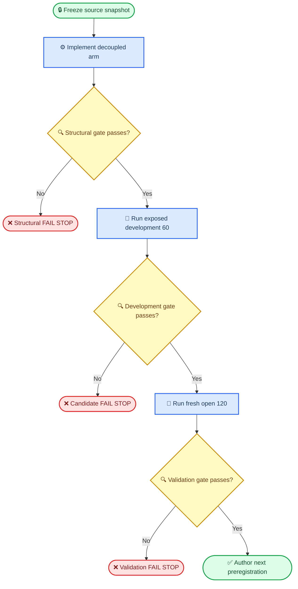

# Textbook opacity v4r6 decoupled grey-mass and convective-temperature work plan

_Development and prospective-validation plan, 2026-08-28. This document is a work plan, not a preregistration and not evidence that the candidate has passed._

---

## 📋 Executive decision

The next candidate should isolate the suspected failure in the current
radiative-convective construction:

```text
m_seed     = v4r6 mass integrated with Eddington-grey temperature
T_seed     = current Saha-aware convective temperature evaluated on P_grey = g m_grey
kappa_seed = kappa_v4r6(T_seed, P_grey)
```

The candidate must not re-integrate column mass after applying the convective
temperature replacement. Its working name is
`v4r6_decoupled_mgrey_tconv_v1`.

This candidate is a solver-basin diagnostic. It does not reopen the v4r6
offline `FAIL_STOP`, repair H-minus, change the production solver, replace the
default initializer, run a spectral gate, or open a sealed holdout.

The immediate objective is to answer one causal question:

> Does the current convective temperature remain useful when the grey-derived
> mass column is preserved?

## 🎯 Scientific basis and hypotheses

### Existing evidence

| Evidence | Frozen result | Consequence |
|---|---:|---|
| v4r6 offline opacity gates | Both pass | Opacity is not the first target |
| v4r6 true-`(P,T)` mass gates | Cool `0.2468`, middle `0.2074` | Historical `FAIL_STOP` remains |
| Convective v4r6 development-60 | `20/60`, cool `0/27`, hot `20/33` | Current coupled seed misses the basin |
| Grey v4r6 development-60 | `37/60`, cool `6/27`, hot `31/33` | Grey mass construction preserves a wider basin |
| Middle-mass attribution | `MIXED` | No single opacity-temperature patch is justified |
| Cool continuum attribution | H-minus implementation-level gap | A separate opacity-correctness branch remains possible |

Authoritative prior artifacts:

- [v4r6 offline preregistration](textbook_opacity_v4r6_preregistration_20260828.md)
- [v4r6 convective development-60](textbook_opacity_v4r6_dev60_preregistration_20260828.md)
- [v4r6 grey development-60](textbook_opacity_v4r6_grey_dev60_preregistration_20260828.md)
- [v4r6 middle-mass attribution](textbook_opacity_v4r6_midmass_slice_preregistration_20260828.md)
- [v4r6 cool-continuum attribution](textbook_opacity_v4r6_cool_continuum_attribution_preregistration_20260828.md)

### Primary hypothesis

`H1_MASS_REINTEGRATION_DAMAGE`: the main basin loss is caused by
re-integrating `m` after applying the convective `T` profile. Preserving
`m_grey` while retaining `T_conv` will improve cool-star convergence and
retain most of the grey arm's hot-star convergence.

### Null and alternative outcomes

- `H0_NO_GAIN`: the decoupled arm does not improve materially over the grey arm
- `T_CONSTRUCTION_STILL_BAD`: preserving `m_grey` is insufficient because the
  convective `T` construction itself remains outside the cool-star basin
- `INCONCLUSIVE_RUNTIME`: timeouts, incomplete records, source drift, or
  provenance gaps prevent a paired interpretation

No result from the already-open development-60 can establish generalization or
production readiness.

## 🔒 Frozen scientific boundaries

### Historical artifacts

The following remain immutable controls:

- `textbook_opacity_v4r6_offline_validation_20260828.json`
- `textbook_opacity_v4r6_dev60_20260828.json`
- `textbook_opacity_v4r6_grey_dev60_20260828.json`
- all v4 through v4r6 source identities and result files

No existing JSON, JSONL, note, runner, threshold, or candidate name may be
overwritten.

### Candidate restrictions

The candidate may use only:

- the five stellar labels
- the registered optical-depth grid
- v4r6 constants and opacity functions
- the current Saha-aware adiabatic-gradient calculation
- deterministic numerical integration with the existing eight substeps

The candidate may not use:

- stored `m`, `T`, `P`, `n_e`, or opacity as runtime inputs
- a learned checkpoint, fitted coefficient, interpolated correction, or
  corpus-derived lookup
- H-minus implementation changes
- a new convection threshold, smoothing width, damping factor, blend
  coefficient, or temperature floor
- a changed solver policy, convergence tolerance, iteration cap, timeout, or
  retry policy

Stored truth may be used only after seed construction to report diagnostic
errors. It must never enter the candidate path.

### Dataset boundaries

- The historical development-60 is already exposed and may be used only for
  paired mechanism development
- A fresh open validation sample must exclude the historical development-60,
  every registered excluded manifest, and every sealed holdout
- No sealed data may be inspected, selected, run, or summarized

## ⚙️ Candidate and control definitions

### Three development arms

| Arm | Temperature | Mass | Role |
|---|---|---|---|
| `v4r6_convective` | Current convective | Re-integrated | Frozen control |
| `v4r6_grey` | Eddington-grey | Grey-integrated | Frozen control |
| `v4r6_decoupled` | Current convective | Grey-integrated | New candidate |

The new arm must satisfy:

```text
m_decoupled == m_grey
T_decoupled == T_convective
P_decoupled == g * m_grey
kappa_decoupled == kappa_v4r6(T_convective, P_decoupled)
```

The first two identities must be bitwise exact on the registered seed audit.
The opacity identity must pass a fresh direct recomputation at
`rtol <= 1e-12`, `atol = 0`.

### Implementation rule

Implement a candidate-specific function rather than changing the numerical
behavior of an existing v4r6 function. Suggested public entry points:

```python
build_textbook_reduced_state_v4r6_decoupled(...)
predict_textbook_reduced_state_v4r6_decoupled(...)
```

The current convective arm must retain its mass re-integration. The current
grey arm must retain `include_convection=False`. Historical-arm regression
tests must demonstrate no numerical drift.

## 🔄 Gate sequence



Every gate is sequential. A failed or inconclusive gate blocks all later
stages.

## ✍️ Work packages

### WP0 — establish an auditable source snapshot

Before any scientific run:

1. Record `git status --short`
2. Record the current branch and `HEAD`
3. Hash every relevant source, test, runner, manifest, and control JSON
4. Record the complete diff or commit containing the candidate
5. Record Python, NumPy, Numba, operating system, hostname, and environment
6. Write a machine-readable source manifest

Preferred state: the candidate, tests, runner, and preregistration are committed
before the solver run. If that is not possible, the formal run must stop unless
an immutable source archive and binary diff are hashed before execution.

Planned artifact:

```text
results/analytic_initializer/
  textbook_opacity_v4r6_decoupled_source_manifest_<RUN_DATE>.json
```

Required manifest fields:

```json
{
  "candidate": "v4r6_decoupled_mgrey_tconv_v1",
  "git_head": "<sha-or-null>",
  "git_dirty": "<true-or-false>",
  "git_diff_sha256": "<sha256>",
  "hostname": "<host>",
  "python": "<version>",
  "numpy": "<version>",
  "numba": "<version>",
  "source_sha256": {},
  "input_sha256": {},
  "control_result_sha256": {}
}
```

### WP1 — implement the isolated candidate

Primary file:

```text
experiments/analytic_initializer/textbook_opacity.py
```

Implementation sequence:

1. Compute `T_grey` with the unchanged Eddington relation
2. Integrate `m_grey` with unchanged v4r6 opacity and eight substeps
3. Compute `P_grey = g m_grey`
4. Compute the current `nabla_rad`, `nabla_ad`, and convective onset on the
   grey state
5. Reproduce the current convective `T` replacement exactly
6. Keep `m_seed = m_grey`; do not call the mass integrator again
7. Recompute `kappa_seed` using `(T_conv, P_grey)`
8. Return explicit diagnostics identifying
   `mass_reintegrated_after_convection=false`

Do not refactor historical v4r6 code during this work package. Duplication is
acceptable if it makes the candidate boundary and historical regression
clearer.

### WP2 — add focused tests

Suggested new test file:

```text
tests/test_textbook_opacity_v4r6_decoupled.py
```

Required tests:

- [ ] Candidate output shapes match the existing v4r6 outputs
- [ ] Every candidate `m`, `T`, and `log10(kappa)` value is finite
- [ ] Every candidate `m`, `T`, and `kappa` value is positive
- [ ] Candidate `m` is bitwise equal to the grey arm
- [ ] Candidate `T` is bitwise equal to the convective arm
- [ ] Candidate opacity matches a fresh direct v4r6 recomputation
- [ ] Candidate path does not read stored atmospheric state
- [ ] Existing grey and convective outputs remain unchanged
- [ ] Existing v4 through v4r6 regression tests remain unchanged
- [ ] The candidate has zero fitted parameters

Local verification command:

```bash
PYTHONPATH=. NUMBA_THREADING_LAYER=workqueue \
  .venv/bin/python -m pytest -q \
  tests/test_textbook_opacity_v4r6_decoupled.py \
  tests/test_textbook_opacity.py
```

Failure of any required test is `STRUCTURAL_FAIL_STOP`.

### WP3 — write the seed-only audit

Add a seed-only audit runner:

```text
experiments/analytic_initializer/
  run_textbook_opacity_v4r6_decoupled_seed_audit.py
```

It must build all three seed arms on the frozen development-60 without running
the production solver.

Output:

```text
results/analytic_initializer/
  textbook_opacity_v4r6_decoupled_seed_audit_<RUN_DATE>.json
```

Required quantities:

- finite and positive star counts
- exact identity checks for `m_decoupled == m_grey`
- exact identity checks for `T_decoupled == T_convective`
- direct opacity recomputation residual
- all-layer and `tau > 10` errors against stored truth
- cool and hot splits at `Teff = 7500 K`
- per-star diagnostics, not only pooled percentiles

Truth errors are characterization only. They are not solver gates and must not
be used to alter the candidate.

### WP4 — preregister and run the exposed development-60

Create a separate preregistration after WP0–WP3 pass and before any candidate
solver execution:

```text
notes/
  textbook_opacity_v4r6_decoupled_dev60_preregistration_<RUN_DATE>.md
```

Add a pinned runner:

```text
experiments/analytic_initializer/
  run_textbook_opacity_v4r6_decoupled_dev60.py
```

The runner must pin:

- arm `textbook_v4r6_decoupled`
- the exact historical development-60 indices
- one trial
- 15 iterations
- 900 seconds per star
- resumable JSONL
- a new output path

Planned outputs:

```text
results/analytic_initializer/
  textbook_opacity_v4r6_decoupled_dev60_<RUN_DATE>.json
  textbook_opacity_v4r6_decoupled_dev60_<RUN_DATE>.jsonl
logs/
  textbook_opacity_v4r6_decoupled_dev60_<RUN_DATE>.log
```

The two historical controls must be read from their frozen JSON artifacts and
must not be rerun.

### WP5 — construct and run fresh open validation

This stage is authorized only after `PASS_TO_FRESH_OPEN`.

Create a deterministic sample of 120 previously unused, non-sealed stars from
the strict-truth corpus:

| Stratum | Count | Definition |
|---|---:|---|
| Cool dwarf | 30 | `Teff < 7500 K`, `logg >= 3.5` |
| Cool giant | 30 | `Teff < 7500 K`, `logg < 3.5` |
| Hot dwarf | 30 | `Teff >= 7500 K`, `logg >= 3.5` |
| Hot giant | 30 | `Teff >= 7500 K`, `logg < 3.5` |

Selection rules:

1. Exclude every existing registered exclusion manifest
2. Exclude all historical development-60 indices
3. Exclude every sealed or previously unblinded holdout index
4. Use deterministic seed `20260829`
5. Sample without replacement
6. Sort selected corpus indices before writing the manifest
7. Stop if any stratum cannot supply 30 valid stars; do not redistribute

The corpus contains enough stars in all four broad strata, but eligibility
must be recomputed after all exclusions.

This is fresh only with respect to candidate solver outcomes. It is still an
open development corpus and may have contributed to earlier aggregate opacity
diagnostics; it is not an independent sealed physics validation.

Manifest:

```text
results/analytic_initializer/
  textbook_opacity_v4r6_decoupled_fresh120_manifest_<RUN_DATE>.json
```

Run exactly two arms on the same 120 indices:

- frozen `v4r6_grey`
- `v4r6_decoupled`

Do not run the historical convective arm on this new sample unless a separate
preregistration explicitly requires it.

Planned results:

```text
results/analytic_initializer/
  textbook_opacity_v4r6_grey_fresh120_<RUN_DATE>.json
  textbook_opacity_v4r6_grey_fresh120_<RUN_DATE>.jsonl
  textbook_opacity_v4r6_decoupled_fresh120_<RUN_DATE>.json
  textbook_opacity_v4r6_decoupled_fresh120_<RUN_DATE>.jsonl
```

### WP6 — close the candidate

Write one immutable closeout note containing:

- source and environment manifest hash
- sample-manifest hash
- every result and JSONL hash
- exact gate decisions
- all stopped or unrun stages
- allowed next action

Possible final labels:

- `FAIL_STOP_STRUCTURAL`
- `FAIL_STOP_DEVELOPMENT`
- `FAIL_STOP_FRESH_OPEN`
- `INCONCLUSIVE_RUNTIME`
- `PASS_TO_COUPLED_ODE_PREREGISTRATION`

None of these labels authorizes production, spectra, or sealed-holdout work.

## 📊 Metrics and decision gates

### Structural gate

All conditions are mandatory:

| Check | Requirement |
|---|---|
| Candidate finite | `60/60` |
| Candidate positive | `60/60` |
| Mass identity | Bitwise exact to grey |
| Temperature identity | Bitwise exact to convective |
| Opacity identity | `rtol <= 1e-12`, `atol = 0` |
| Fitted parameters | `0` |
| Historical regressions | No change |
| Provenance manifest | Complete and hashed |

Failure gives `FAIL_STOP_STRUCTURAL`.

### Development-60 continuation gate

The development-60 is exposed; this gate decides only whether a fresh open
validation is worth the compute cost.

All conditions are mandatory:

| Metric | Requirement |
|---|---:|
| Complete records | `60/60` |
| Solver errors | `0` |
| Finite seeds | `60/60` |
| Cool convergence | `>= 11/27` |
| Hot convergence | `>= 30/33` |
| Total convergence | `>= 41/60` |
| Losses among 37 grey-converged stars | `<= 2` |
| Net paired gains minus losses | `>= 4` |
| Timeouts | `<= 3` |

Mean iterations, seed-truth errors, and individual-star narratives are
reported but are not gates.

If runtime integrity fails, use `INCONCLUSIVE_RUNTIME`; otherwise any failed
criterion gives `FAIL_STOP_DEVELOPMENT`. Do not relax thresholds or add a
second trial after seeing the result.

### Fresh-open validation gate

Timeouts count as non-convergence. The paired analysis must report the four
discordant counts: candidate-only success, grey-only success, both success,
and neither success.

All conditions are mandatory:

| Metric | Requirement |
|---|---:|
| Complete records per arm | `120/120` |
| Solver errors per arm | `0` |
| Finite candidate seeds | `120/120` |
| Cool net convergence gain | `>= 6/60` |
| Cool paired superiority | One-sided exact McNemar `p <= 0.05` |
| Hot net convergence difference | `>= -3/60` |
| Total net convergence gain | `>= 5/120` |
| Source/environment/solver signatures | Same except arm identity |

If more than 5% of either arm terminates in infrastructure timeouts, mark the
comparison `INCONCLUSIVE_RUNTIME` rather than scientific failure.

Passing gives only `PASS_TO_COUPLED_ODE_PREREGISTRATION`. Failing gives
`FAIL_STOP_FRESH_OPEN`.

## 💾 Machine-readable result contract

Every final JSON must include:

```json
{
  "status": "development_only",
  "decision": "<registered-label>",
  "candidate": "v4r6_decoupled_mgrey_tconv_v1",
  "source_manifest": "<path>",
  "source_manifest_sha256": "<sha256>",
  "sample_manifest": "<path>",
  "sample_manifest_sha256": "<sha256>",
  "runtime_signature": {},
  "solver_policy": {
    "trials": 1,
    "iterations": 15,
    "per_star_timeout_seconds": 900
  },
  "initializer_provenance": {
    "opacity": "textbook_rosseland_opacity_v4r6",
    "temperature": "current_saha_aware_convective_temperature",
    "mass": "v4r6_grey_integrated_mass",
    "mass_reintegrated_after_convection": false,
    "fitted_parameter_count": 0,
    "offline_decision": "FAIL_STOP"
  },
  "records": [],
  "paired_summary": {},
  "teff_split": {},
  "gravity_split": {}
}
```

JSONL must contain one unique record per corpus index. Resume logic must reject:

- duplicate indices with conflicting outcomes
- a changed source manifest
- a changed sample manifest
- a changed arm or runtime signature
- a changed solver policy

## 🔧 Verification and execution commands

### Local structural verification

Use the project environment:

```bash
PYTHONPATH=. NUMBA_THREADING_LAYER=workqueue \
  .venv/bin/python -m pytest -q \
  tests/test_textbook_opacity_v4r6_decoupled.py \
  tests/test_textbook_opacity.py
```

Run the seed-only audit locally only if it does not evaluate production
opacity:

```bash
PYTHONPATH=. NUMBA_THREADING_LAYER=workqueue \
  .venv/bin/python \
  experiments/analytic_initializer/run_textbook_opacity_v4r6_decoupled_seed_audit.py
```

### Remote solver execution

Host and checkout:

```text
astronode-garching
/home/jdli/xiasangju/jdli/payne-zero
.venv-linux/bin/python
```

Before launch, verify that remote source hashes equal the frozen source
manifest. Then run only the registered runner:

```bash
INITIALIZER_RUN_DATE=YYYYMMDD
PYTHONPATH=. NUMBA_THREADING_LAYER=workqueue \
  .venv-linux/bin/python \
  experiments/analytic_initializer/run_textbook_opacity_v4r6_decoupled_dev60.py \
  2>&1 | tee "logs/textbook_opacity_v4r6_decoupled_dev60_${INITIALIZER_RUN_DATE}.log"
```

Do not launch the candidate and a control simultaneously on the same node.

### Artifact return and verification

For every transferred artifact, record:

- remote path and byte size
- local path and byte size
- remote SHA-256
- local SHA-256
- exact match decision

Missing logs, unequal hashes, or unequal byte sizes give
`INCONCLUSIVE_RUNTIME`.

## ⚠️ Risk register

| Risk | Detection | Required response |
|---|---|---|
| Dirty-source ambiguity | Missing source hash | Stop before solver |
| More than one physics change | Diff review | Split candidate |
| Oracle leakage | Runtime-input audit | Structural fail |
| Development overfitting | Repeated formula edits | New version; no promotion |
| Timeout imbalance | Outcome split by arm | Inconclusive |
| Historical baseline drift | Bitwise regression | Structural fail |
| Decoupled inconsistency | Residual diagnostics | Report; do not hide |
| Threshold movement | Preregistration diff | Formal fail |

The decoupled seed is intentionally not hydrostatically self-consistent after
the temperature replacement. That is the controlled intervention, not a
hidden defect. The unchanged production solver remains responsible for
restoring full consistency.

## 🚫 Explicit stop rules

Stop immediately if any of the following occurs:

- a historical v4–v4r6 output changes
- candidate mass differs from grey mass
- candidate temperature differs from current convective temperature
- any fitted or oracle quantity enters the candidate
- the runner uses more than one trial
- the sample differs from its manifest
- source or runtime signatures differ across paired arms
- a registered gate fails
- a sealed index is selected

After a stop:

- preserve the candidate source and failed JSON
- preserve the exact thresholds
- write the machine decision
- do not tune a blend fraction, convection threshold, or damping factor on the
  same result
- do not run spectra, production, or sealed holdout

## 📍 If the candidate passes

Passing fresh-open validation authorizes only a new plan for a physically
coupled temperature-mass construction. The next candidate would solve or
continue toward:

```text
dm/dtau       = 1 / kappa(P, T)
dlnT/dlnP     = min(nabla_rad, nabla_ad)
P             = g m
```

That future work should use a continuation from the successful decoupled seed
and must have its own formula, version, preregistration, development controls,
and stop rules.

The H-minus implementation repair remains a separate opacity-correctness
branch. It must not be combined with the decoupled candidate because that
would destroy the single-variable attribution.

## ✅ Definition of done

This work plan is complete when:

- [ ] Candidate code exists under a new identity
- [ ] Historical v4–v4r6 paths are unchanged
- [ ] Focused and historical regression tests pass
- [ ] Source and environment manifest is complete
- [ ] Seed-only audit passes all structural identities
- [ ] Development-60 preregistration is frozen before solver execution
- [ ] Development-60 JSON, JSONL, log, and hashes are complete
- [ ] Development gate has an explicit machine decision
- [ ] Fresh-open manifest is frozen before either arm runs, if authorized
- [ ] Fresh-open paired artifacts and hashes are complete, if authorized
- [ ] Closeout note states what passed, what failed, and what was not run
- [ ] Production, spectra, and sealed holdout remain untouched

Worst-case registered solver budget is 15 node-hours for development-60 and
60 node-hours for the two fresh-open 120-star arms. No compute beyond the
current authorized gate should be launched.
